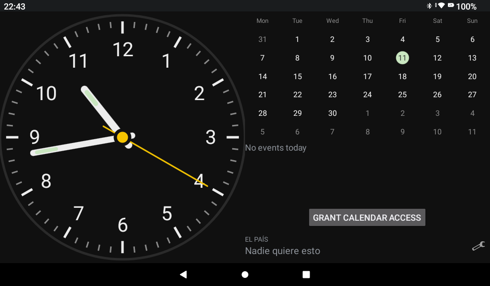
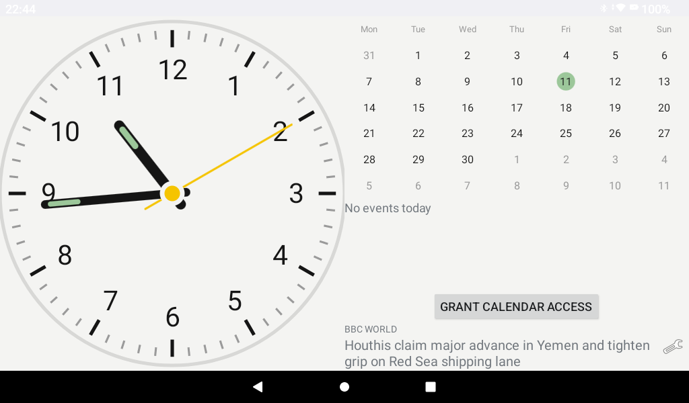
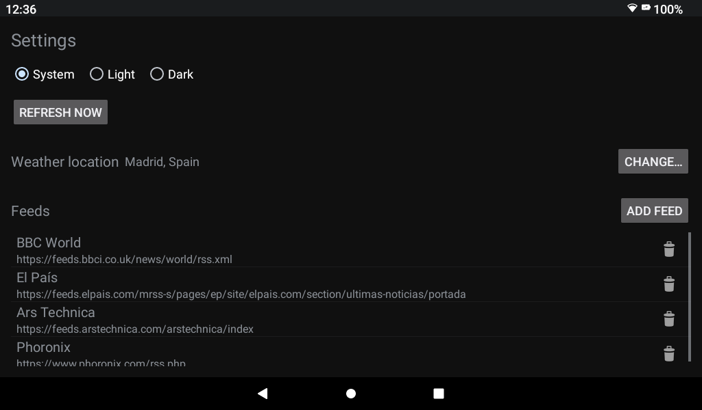

# AkinoClock

An analog clock in the style of the Braun BC12 alarm clock, sharing one screen with a
current-month calendar, a weather strip, and a configurable RSS headline carousel. The clock
shows a fourth hand for the next system alarm when one is set within 12 hours. Built for a
low-cost tablet with Android 13.

The weather strip shows today's condition and temperature plus a two-day forecast, for a location
picked once in Settings via city search — no location permission, no Play Services.

| Dark | Light |
|---|---|
|  |  |

Feeds, weather location, theme and refresh are configured from an in-app settings screen:



## Build / test / install

```sh
./gradlew test                                  # all JVM unit tests (JUnit + Robolectric)
./gradlew assembleDebug                         # build the debug APK
./gradlew installDebug                          # install on the connected device
adb shell am start -n org.akinosoft.akinoclock.debug/org.akinosoft.akinoclock.app.MainActivity
./gradlew connectedDebugAndroidTest             # instrumented tests (rare, on-device)
```

Requires JDK 17+, Android SDK with `compileSdk` 34 and Build-Tools 36.

### Release build

A signed release build requires a `keystore.properties` file (see
`keystore.properties.example`) pointing at your own keystore:

```sh
keytool -genkeypair -v -keystore /path/to/your.jks -alias akinoclock -keyalg RSA -keysize 2048 -validity 10000
cp keystore.properties.example keystore.properties   # then fill in storeFile/storePassword/keyAlias/keyPassword

./gradlew assembleRelease                       # -> app/build/outputs/apk/release/app-release.apk
adb install -r app/build/outputs/apk/release/app-release.apk
adb shell am start -n org.akinosoft.akinoclock/.app.MainActivity
```

## License

MIT — see [LICENSE](LICENSE).
